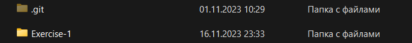
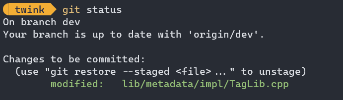
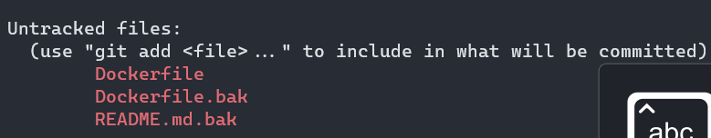
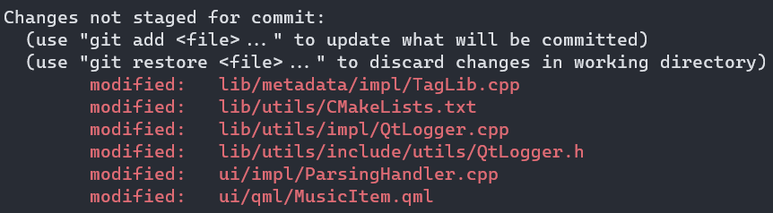
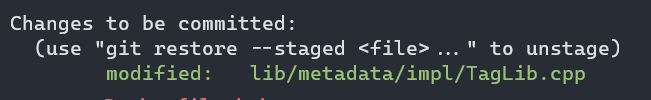
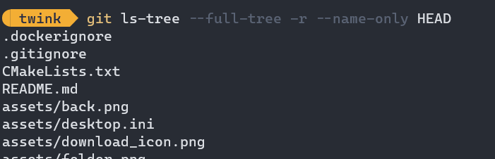
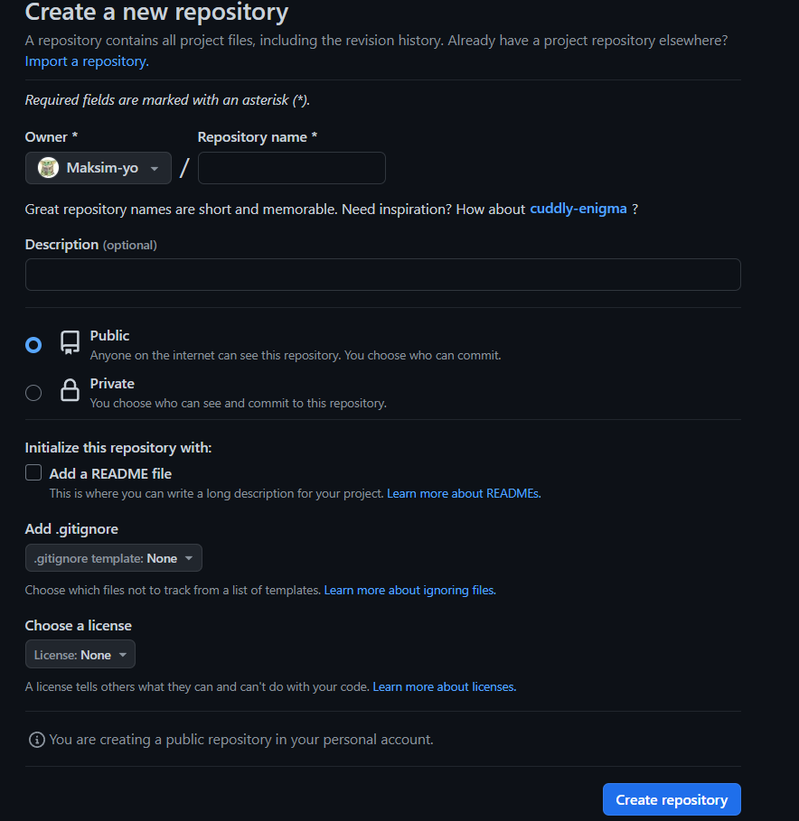
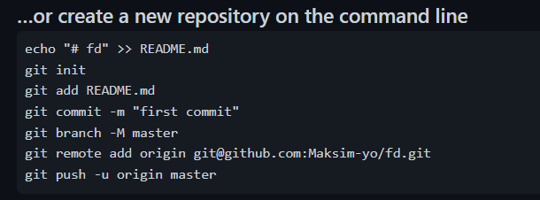
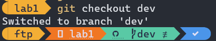

# **Инструкция по работе с Git**
***
## Установка Git
* Переходим на [сайт](https://git-scm.com/downloads) и скачиваем нужную нам версию.

## Подготовка рабочего места
 Для проверки правильности установки Git необходимо написать команду Git version, в результате которой выведется текущая версия git. 
* git config --global user.name "maksim-yo" - задаём имя пользователя для коммитов.
* git config --global user.email "lyzlov023@gmail.com" - задаём email для коммитов.
* git version - покажет версию Git, которая установлена.

Для Windows необходимо также прописать путь к git.exe в системной переменной PATH для возможности его запсука с командной строки
Для инициализации репозитория прописываем команду git init. 

В ходе чего, создается скрытая папка с информацией о репозитории.

 Для добавления файлов в репозиторий используется команда git add.

Для провевки состояние директории используется команада git status, которая выведет текущее состояние файлов. 

<!-- https://git-scm.com/images/logos/1color-darkbg@2x.png -->

## Состояния Git
 Git имеет следующие состояния:
 * неотслеживаемое (untracked)  
   Файлы, которые созданы и не добавлены в репозиторий
   
 * измененное (modified)  
   Файлы, которые были изменены, но не добавлены в текущее хранилище
   
 * подготовленное (staged)  
   Файлы, которые были добавлены в текущее хранилище.
  
 * закомиченное (committed)  
   Файлы, которые были staged попадают в репозиторий
   
## Инициализация репозитория
* git init - инициализация репозитория.
* git add <filename> - добавить файл в репозиторий.
* git add . - добавляет все файлы в репозиторий.
* git status - отображает состояние директории, показывает, если файл не отслеживается Git.
При необходимости наличия, созданного локального репозитория командой git init, на удаленном сервере, необходимо создать его репозиторий на сервере github, для чего требуется авторизации.
 
После создания репозитория появится небольшая инструкция, с помощью которой можно поместить локальный репозиторий на сервер github.  

Изначально имеется 1 ветка, которая создаётся при инициализации репозитория.
 
Для ведения параллельной разработке необходимо создать ветку с помощью команды  git branch <name>

Для перехода в новую ветку используется команада git checkout <name>. Для слияние новых веток используют команду git merge <name>

## Ветки в Git
* git branch <name> - создаёт новую ветку.
* git checkout <name> - переходит на заданную ветку.
* git merge <name> - слияет указанную ветку с основной.
##### Возможные конфликты слияния
* Выполнение команды слияния прерывается в самом начале, если Git обнаруживает изменения в рабочем каталоге или разделе проиндексированных файлов текущего проекта. Git не может выполнить слияние, поскольку иначе эти ожидающие изменения будут перезаписаны новыми коммитами.
**Решение:** локальное состояние необходимо стабилизировать с помощью команд git stash, git checkout, git commit или git reset.
* Сбой в процессе слияния говорит о наличии конфликта между текущей локальной веткой и веткой, с которой выполняется слияние. Это свидетельствует о конфликте с кодом другого разработчика. Git сделает все возможное, чтобы объединить файлы, но оставит конфликтующие участки, чтобы вы разрешили их вручную.
**Решение:** в этом случае нам нужно изменить конфликтующие файлы вручную.
## История коммитов и работа с коммитами
* git log - отображает историю коммитов с изменениями.
* git log --graph - отображает дерево зависимостей для всех коммитов.
* git log --oneline - отображает коммиты в одну строку (только хэш и сообщение).
* git log --oneline --stat - отображает статистику изменённых файлов для каждого коммита, при этом в одну строку.
* git diff - отображает разницу между любыми двумя Git деревьями (коммиты, например).
* git commit -a -m "text" - записывает изменения в репозиторий и автоматически добавляет все измененные файлы в индекс.
* git commit -m "text" - записывает изменения в репозиторий.
* git commit --amend -m "text" - записывает изменения последнего коммита.
## Работа с удаленным репозиторием
* git remote add <shortname> <url> - добавляет удалённый репозиторий и присваивает ему имя.
* git push <remote-name> <branch-name> - отправляет изменения (имя ветки) на сервер.
## Файл gitignore
* gitignore - файл, необходимый для игнорирование определенных файлов и директорий при добавлений в репозиторий.

